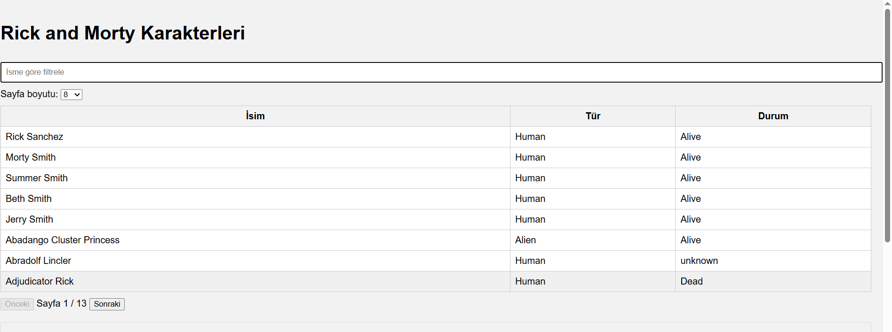

# RickAndMortyApp

A character browser built with React Native, TypeScript, and Expo using the Rick and Morty API.

This is an [Expo](https://expo.dev) project created with [`create-expo-app`](https://www.npmjs.com/package/create-expo-app).

##  Başlangıç

1. Gerekli bağımlılıkları yükleyin:

   ```bash
   npm install

2. Uygulamayı başlatın:
   ```bash
   npx expo start

3. Web Tarayıcı: w tuşuna basarak web sürümünü açabilirsiniz.


##  Uygulama Ekran Görüntüsü



